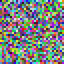
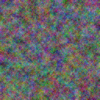
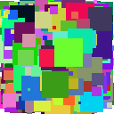
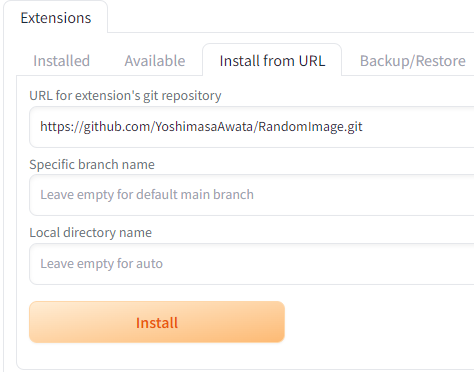

# RandomImage README #

ランダムなノイズ画像を指定サイズで作成します。

まぁ、*Photoshop*や*GIMP*等のペイント系ソフトに搭載された機能で作成できますので、それらを使用すれば十分です。

ただ、専用のツールですので、多少は使い勝手が良いかと…。

## 機能 ##

以下の機能を提供します。

1. 以下のような"smooth image", "turbulence image"および"tile image"等を作成できます。  
  
1. 画像サイズは幅と高さ共に128ピクセルから8192ピクセルまで、32ピクセル単位で指定できます。
1. カラーの画像の他、グレースケールの画像を作成できます。

## 要件 ##

**Python** v3.10以上を推奨します。

また*Github*からダウンロードするため、**Git**がインストールされているほうが便利です。

## 使い方 ##

### インストール ###

*Github*から直接ダウンロードするか、**Git**がインストールされていれば以下のコマンドでダウンロードできます。

``` shell
git clone https://github.com/YoshimasaAwata/RandomImage.git
```

### 設定 ###

まず、**Python**の仮想環境を設定し、仮想環境に切り替えます。

``` shell
cd RandomImage
python -m venv vnev
.\venv\Scripts\activate.bat
```

次に仮想環境に必要なモジュールをダウンロードします。

``` shell
pip install -r requirements.txt
```

### 起動 ###

起動する前に**Python**の仮想環境に切り替えます。  
すでに仮想環境になっている場合には必要ありません。

``` shell
.\venv\Scripts\activate.bat
```

アプリケーションを起動します。

``` shell
python scripts\random_image.py
```

以下のように表示されますので、指定のURLにブラウザでアクセスすれば、GUIが表示されます。

``` shell
Running on local URL:  http://127.0.0.1:7860
```

### Stable Diffusion Web UIへのインストール ###

**Stable Diffusion Web UI**の拡張機能として使用する事ができます。

1. **Stable Diffusion Web UI**を起動し、"Extensions"タブをクリックします。
1. "Install from URL"タブをクリックします。
1. "URL for extension's git repository"に"https\://github.com/YoshimasaAwata/RandomImage.git"と記入し"Install"ボタンをクリックします。
1. "Installed"タブをクリックし、"Apply and restart UI"ボタンをクリックします。



"RandomImage"のタブが表示されます。

### 各パラメーターについて ###

#### 共通項目 ####

"Smooth", "Turbulence"および"Tile"に共通するパラメーターです。

##### Width / Height #####

画像のサイズをピクセル単位で指定します。

最小の設定値は128ピクセル、最大の設定値は8192ピクセルです。  
32ピクセル単位での指定となります。

##### "⇧⇩"ボタン #####

クリックすると画像の"Width"と"Height"の値が入れ替わります。

##### "512x512"ボタン #####

クリックすると画像の"Width"と"Height"の値が512ピクセルに設定されます。

##### "768x768"ボタン #####

クリックすると画像の"Width"と"Height"の値が768ピクセルに設定されます。

##### "1024x1024"ボタン #####

クリックすると画像の"Width"と"Height"の値が1024ピクセルに設定されます。

##### "1152x896"ボタン #####

クリックすると画像の"Width"の値が1152ピクセルに、"Height"の値が896ピクセルに設定されます。

##### "1344x768"ボタン #####

クリックすると画像の"Width"の値が1344ピクセルに、"Height"の値が768ピクセルに設定されます。

##### Colorラジオボタン #####

"RGB"と"GRAYSCALE"を選択できます。

"RGB"を選択するとRGBカラーの画像が生成されます。

"GRAYSCALE"を選択するとグレースケールの画像が生成されます。

##### Seed #####

乱数生成のシード値を指定します。

"-1"を指定した場合には適当なシード値が使用されます。

##### サイコロボタン #####

クリックすると"Seed"の値を"-1"にセットします。

##### リサイクルボタン #####

"Seed actually used"にセットされたシード値を"Seed"にコピーします。

画像が生成されて"Seed actually used"が"-1"以外にセットされた場合のみ有効となります。

##### Output image #####

生成された画像が表示されます。

右上のダウンロードマークをクリックすると生成された画像をダウンロードできます。

マウスの右クリックから"画像をコピー"できます。

##### Create imageボタン #####

クリックすることで、パラメーターにしたがってランダムなノイズ画像を生成します。

##### Clearボタン #####

クリックすることで"Output image"に表示された画像をクリアします。

"Output image"に画像が表示された場合のみ有効となります。

##### Seed actually used #####

ランダムなノイズ画像を生成する際に、実際に使用されたシード値が表示されます。

"Output image"に画像が表示されていない場合には"-1"が表示されます。

#### Smoothタブの項目 ####

"Smooth"は、ランダムな色の画素を隙間なく並べた後、画像を拡大することでランダムなノイズ画像を作成します。

##### Tile sizeラジオボタン #####

画像の拡大倍率を指定します。

幅および高さ方向に同じ拡大率で拡大します。

##### Resampleドロップダウンリスト(Smooth) #####

画像拡大時の拡大方法を選択します。

- NEAREST: 一番近い画素の色をコピーします。
- BILINEAE: 周囲の4つの画素で線形補間します。
- BICUBIC: 周囲の16の画素で3次補間します。
- LANCZOS: ランチョス法により補間します。
- BOX: 各画素をそのままコピーします。
- HAMMING: ハミング法により補完します。

"NEAREST"や"BOX"以外は画像がにじみます。

はっきりとした画素のノイズ画像が必要な場合には"NEAREST"や"BOX"を選択してください。

#### Turbulenceタブの項目 ####

"Turbulence"は、数枚の拡大した"Smooth"のノイズ画像を重ね合わせる事でノイズ画像を作成します。

##### Superposition #####

重ね合わせる"Smooth"のノイズ画像の枚数を指定します。

画像のサイズにより枚数の上限が変わります。  
画像の"Width"や"Height"を変更した場合には、設定が変わっていないか確認してください。

##### Resampleドロップダウンリスト(Turbulence) #####

画像拡大時の拡大方法を選択します。

- NEAREST: 一番近い画素の色をコピーします。
- BILINEAE: 周囲の4つの画素で線形補間します。
- BICUBIC: 周囲の16の画素で3次補間します。
- LANCZOS: ランチョス法により補間します。
- BOX: 各画素をそのままコピーします。
- HAMMING: ハミング法により補完します。

"NEAREST"や"BOX"は画像がはっきりしていますので、画像にスジが混じる場合があります。

きれいなノイズ画像を作成したい場合には"NEAREST"や"BOX"以外を選択してください。

#### Tileタブの項目 ####

"Tile"は、小さなタイルをランダムな位置に指定回数だけ貼り付ける事でノイズ画像を作成します。

##### Shapeドロップダウンリスト #####

貼り付けるタイルの形状を指定します。

- SQUARE: 正方形。
- RECTANGLE: 長方形。
- TRIANGLE: 三角形。
- CIRCLE: 円。
- ELLIPSIS: 楕円。

##### Max tile size #####

各タイルのサイズはランダムに決まりますが、その最大値をピクセル単位で指定します。  
4ピクセル単位での指定となります。

最小値は4ピクセル、最大値は64ピクセルです。

##### Tile num #####

貼り付けるタイルの数を指定します。

"1"以上で、かなりの大きな値を指定できますが、あまり大きな値を指定すると時間ばかり掛かって意味がないので、ほどほどの値を指定します。

##### Backgroundカラーピッカー #####

バックグラウンドカラーを指定します。

色の部分をクリックするとカラーピッカーが表示されますので、色を選択します。

## リリースノート ##

1.0.0: 最初のリリース。

## ToDo ##

- **Stable Diffusion Web UI**におけるCSS適用。
